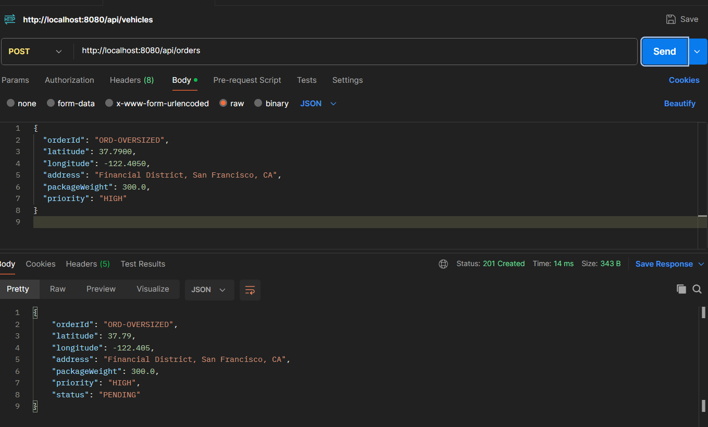
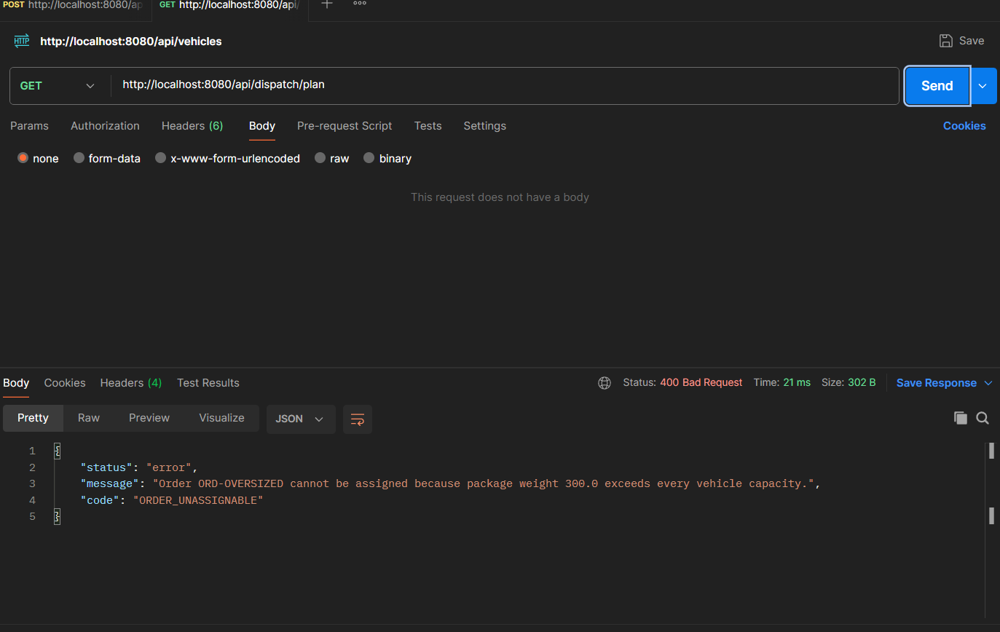
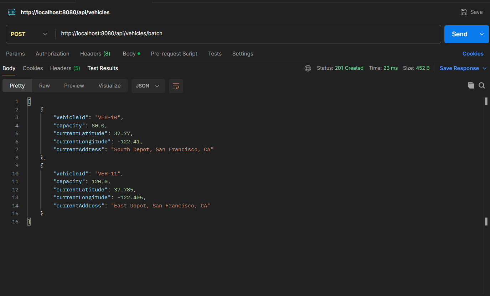
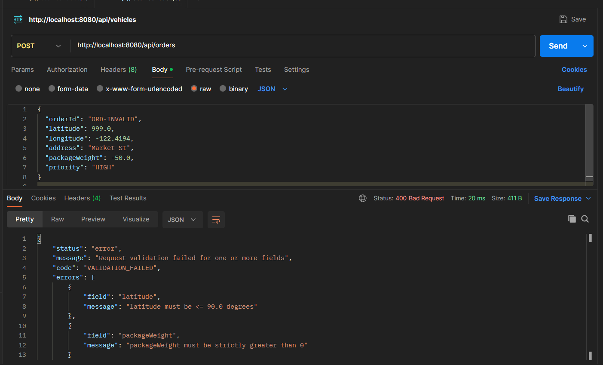

// =>http://localhost:8080/api/vehicles -> POST
// => register the vehicle

// =>http://localhost:8080/api/vehicles -> POST
// => register the second vehicle

// => http://localhost:8080/api/vehicles -> GET
// => get vehicle

// => http://localhost:8080/api/orders -> POST
// => create order

// => http://localhost:8080/api/dispatch/plan -> GET
// => get dispatch plan

// => http://localhost:8080/api/dispatch/plan -> GET
// => get dispatch plan

// => http://localhost:8080/api/orders -> POST
// => create order

// => http://localhost:8080/api/dispatch/plan -> GET
// => get dispatch plan

// => http://localhost:8080/api/orders -> POST
// => create order

// => http://localhost:8080/api/dispatch/plan -> GET
// => get dispatch plan
